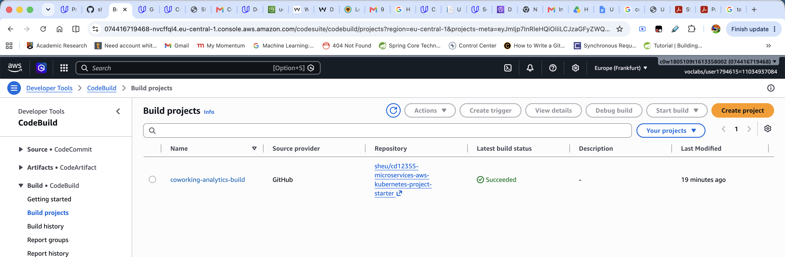
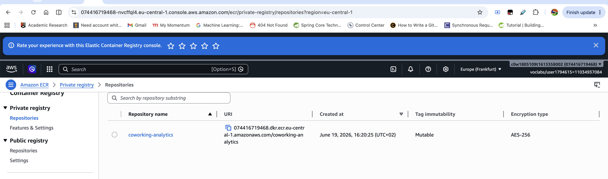
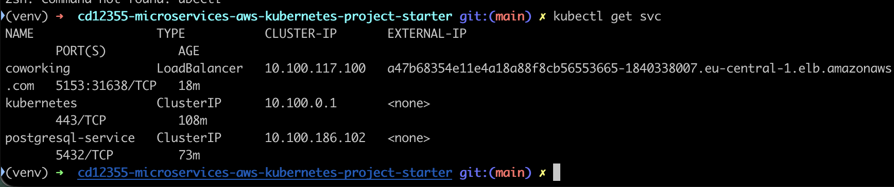
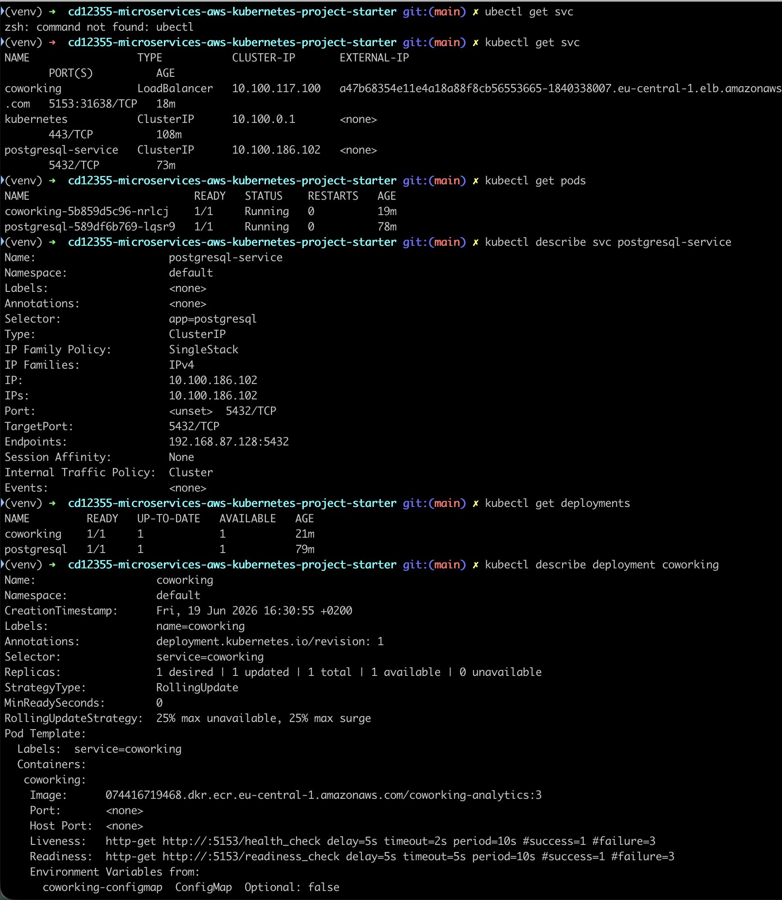
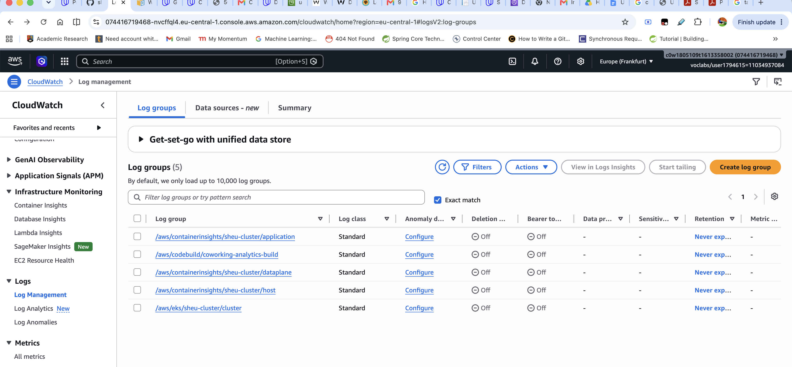
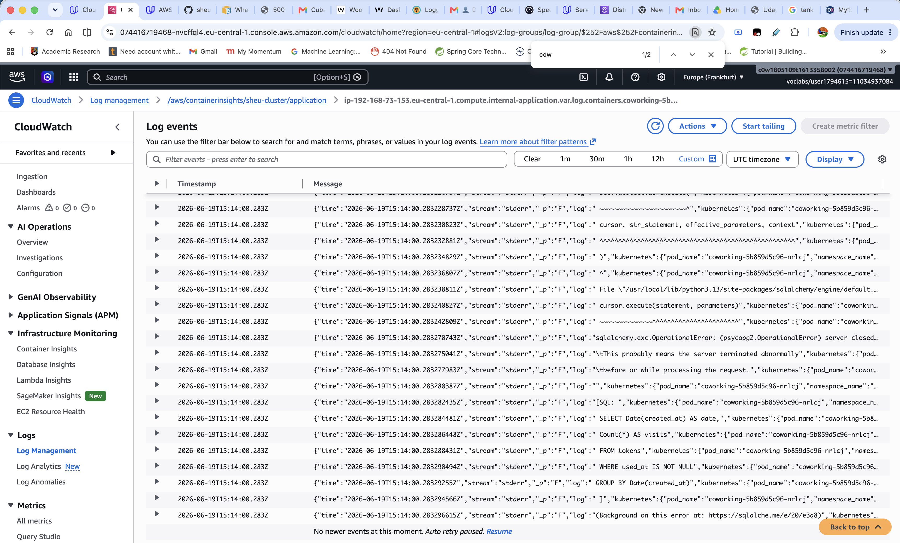
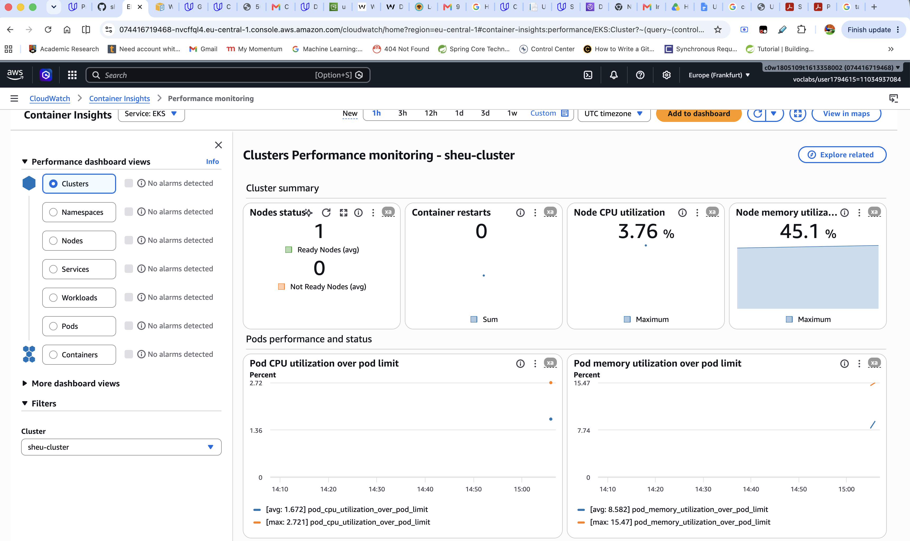

# Coworking Space Analytics Service

## Overview
This project deploys a Flask-based analytics API for the Coworking Space Service onto AWS EKS using a CI/CD pipeline built with CodeBuild and ECR. The API exposes endpoints for daily usage and user visit reports, backed by a PostgreSQL database running as a Kubernetes deployment.

## Architecture
The application follows a microservices pattern: the analytics service and PostgreSQL database run as separate Kubernetes deployments within the same cluster. A ConfigMap holds plaintext environment variables (DB host, port, name, username), while a Secret stores the base64-encoded database password. The application service is exposed via a Kubernetes LoadBalancer, and the database is accessible only within the cluster through a ClusterIP service.

## Build & Deploy Pipeline
Pushing to the `main` branch triggers an AWS CodeBuild pipeline defined in `buildspec.yaml`, which builds the Docker image from `analytics/Dockerfile`, tags it using semantic versioning (`1.0.<BUILD_NUMBER>`), and pushes it to Amazon ECR. To deploy a new build, update the image tag in `deployment/coworking.yaml` and run `kubectl apply -f deployment/coworking.yaml`.

### CodeBuild Pipeline
The `coworking-analytics-build` project is connected to the GitHub repository and reports **Succeeded** after building and pushing the image to ECR.



### Amazon ECR Repository
The `coworking-analytics` private ECR repository stores the Docker images built by the pipeline, hosted at `074416719468.dkr.ecr.eu-central-1.amazonaws.com/coworking-analytics`.



## Deploying Changes
```bash
# Apply config changes
kubectl apply -f deployment/configmap.yaml
kubectl apply -f deployment/secret.yaml
kubectl apply -f deployment/coworking.yaml

# Verify
kubectl get pods
kubectl get svc coworking
```

### Kubernetes Services
Three services are running: `coworking` (LoadBalancer on port 5153 with an AWS ELB external IP), `postgresql-service` (ClusterIP on port 5432), and the default `kubernetes` ClusterIP.



### Kubernetes Deployments and Database Service
Both deployments (`coworking` 1/1 and `postgresql` 1/1) are running and available, with the `postgresql-service` ClusterIP routing traffic to port 5432 on the PostgreSQL pod at endpoint `192.168.87.128:5432`.



## Monitoring

### CloudWatch Log Groups
Fluent Bit ships container logs from all pods to five CloudWatch log groups, including `/aws/containerinsights/sheu-cluster/application` for application logs and `/aws/codebuild/coworking-analytics-build` for build logs.



### Application Logs in CloudWatch
The log stream for the `coworking` pod inside `/aws/containerinsights/sheu-cluster/application` captures the application's periodic database queries in real time. Each JSON log entry shows the SQL executed — `SELECT Date(created_at)`, `COUNT(*)`, `FROM tokens`, `WHERE used_at IS NOT NULL`, `GROUP BY Date(created_at)` — confirming the analytics scheduler is running as expected.



### CloudWatch Container Insights
The `amazon-cloudwatch-observability` EKS add-on provides real-time cluster-level metrics: 1 ready node, 0 container restarts, ~3.76% node CPU utilisation, and ~45.1% node memory utilisation, with per-pod CPU and memory charts.



## Recommended Instance Type
`t3.medium` is well-suited for this workload: it provides 2 vCPUs and 4 GiB RAM, which comfortably runs both the analytics service and PostgreSQL with headroom, while remaining cost-efficient for a low-traffic analytics API.

## Cost Optimisation
Using a single-node EKS cluster with a `t3.medium` spot instance for non-production workloads can reduce compute costs by up to 70%. Enabling EKS Fargate for the analytics pod eliminates idle EC2 costs entirely, as you only pay for vCPU and memory consumed per second. Storing infrequently accessed CloudWatch logs in S3 via log expiry policies further reduces ongoing storage costs.
